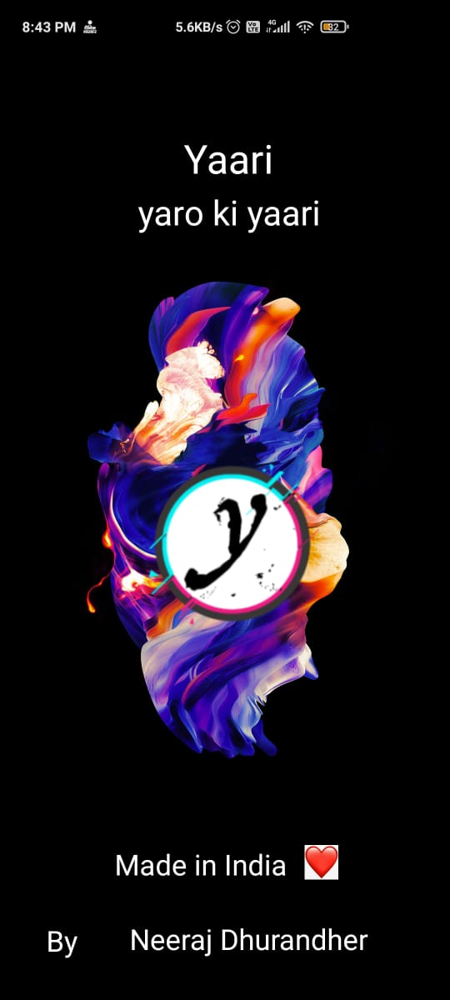
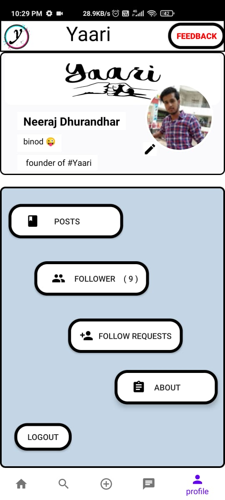
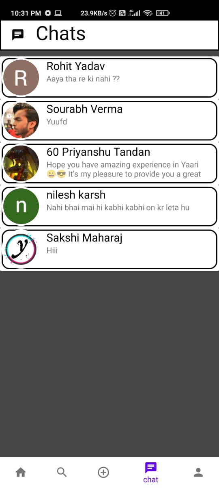
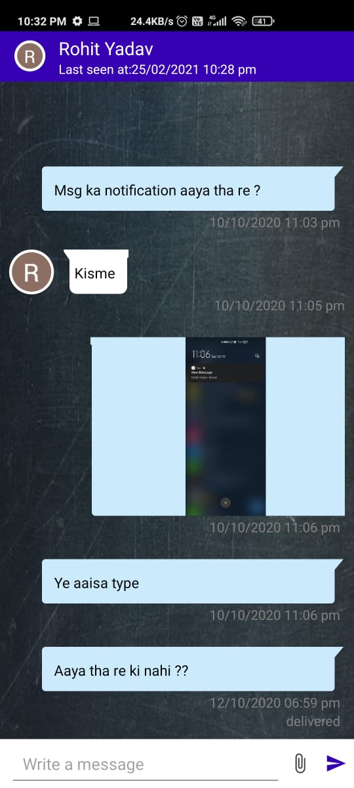

# Yaari
Welcome In a new </b>Social Media Platform</b>, which provides you to make new friends , connect to your friends, family.  

This is the <b>first look</b> of <b>Yaari</b>.

                 

This is <b>Post page</b> where you can see all the lattest                  This is <b>User Profile Page</b>, where user can edit thier profile details,check thier posts ,                       posts uploaded by users.                                                                       followers, follwer requests.

 \t  \t\t\t\t  

This is <b>User's Chat List</b> where user's all chats shows                          This is a <b>Chat Page</b>, where user can send text Messages as well as <b>Images</b>.
 with his/her friends/followers. 
 
    \t\t\t\t   

